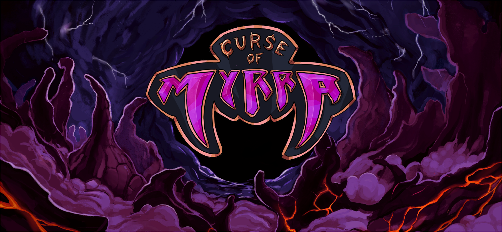

# Curse of Myrra - Assets repository

## Introduction

Welcome to the LambdaClass Assets Repository! We're thrilled to share with you a collection of high-quality 3D models, animations and concept art that we've created for our game world and lore. Our goal is to foster creativity, collaboration, and innovation within the gaming community. Feel free to use, modify, and build upon these assets for your own projects in accordance with our Creative Commons Attirbution 4.0 International License.

## Table of Contents

1. [Overview](#overview)
2. [License](#license)
3. [How to Contribute](#how-to-contribute)
4. [Asset Categories](#asset-categories)
5. [Getting Started](#getting-started)
6. [Credits](#credits)
7. [Contact Us](#contact-us)

## Overview

This repository contains a diverse range of 3D models and concept art that represent the rich and expansive world we've crafted for our games. Whether you're a game developer, artist, or hobbyist, we invite you to explore and integrate these assets into your own projects.

These assets were created for our game [Curse of Myrra](https://github.com/lambdaclass/curse_of_myrra), an open source, mobile battle royale.

## License

All assets in this repository are licensed under the [Creative Commons Attribution 4.0 International License](https://creativecommons.org/licenses/by/4.0/). This is a summary; for the full licensing details, please refer to the [LICENSE](https://github.com/lambdaclass/curse_of_myrra/blob/main/LICENSE) file within this repository.

- **Share:** Copy and redistribute the material in any medium or format.
- **Adapt:** Remix, transform, and build upon the material for any purpose, even commercially.

Under the following terms:

- **Attribution:** You must give appropriate credit, provide a link to the license, and indicate if changes were made. You may do so in any reasonable manner, but not in any way that suggests the licensor endorses you or your use.

## How to Contribute

We welcome contributions to this repository! If you have additional assets, improvements, or corrections, feel free to create a pull request.

## Asset Categories

Explore the different asset categories available in this repository:

- **3D Models**
  - Characters
    - Muflus ✅
    - Uma ⏳
    - D'Agna ⏳
    - H4ck ⏳
  
  - Animations inside each character
    - Skill 1
    - Skill 2
    - Idle
    - Walk
    - Defeat
    - Victory
- **Concept Art**
  - Character Designs
  - Environment Concepts
- **Music**
- **Lore**

## Getting Started

To get started, simply clone or download the repository. Each asset category is organized into folders for easy navigation. Check individual asset folders for any additional usage instructions or notes.

## Credits

We would like to express our gratitude to the talented artists and contributors who have helped create these assets. Their dedication and creativity have played a significant role in bringing our game world to life.

## Contact Us

If you have any questions, feedback, or just want to share your creations using our assets, feel free to reach out to us:

- **Email:** gamedev@lambdaclass.com
- **Twitter:** [@CurseOfMyrra](https://twitter.com/curseofmyrra)
- **Reddit:** [r/curseofmyrra](https://www.reddit.com/r/curseofmyrra/)
- **Discord:** [join link](https://discord.gg/hxDRsbCpzC)
- **Telegram:** [t.me/curseofmyrra](https://t.me/curseofmyrra)

Happy creating, and we can't wait to see the amazing worlds you build with these assets!

